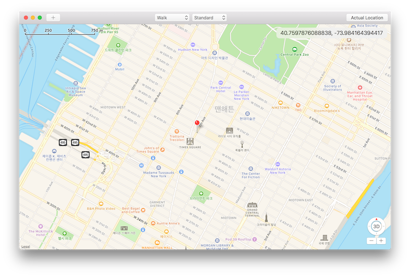

# Pokémon GO Controller for Mac

This project is inspired by [Pokemon-Go-Controller](https://github.com/kahopoon/Pokemon-Go-Controller) project on GitHub.

## Requirements

* Xcode 7.3
* OS X El Capitan (10.11.6)
* iOS device with Pokémon GO
* It may work on other specifications, but not tested.

## Functions

* Specify a location to save as .gpx file.
* Show coordinate of specified location.
* Add and delete favorite location.
* Search route to a destination.
* Automatically move to destination.
* Change speed of movement.
* Change map type (Standard, Hybrid, Satellite).
* Open current location in [PokéVision](https://pokevision.com).

## How to use

1. Download the project and unarchive if necessary.
2. Build and run `Pokemon GO Controller Mac.xcodeproj`.
3. Click any location to specify a starting point.
4. `pokemon_location.gpx` is saved in your `Downloads` folder.
5. Create an empty iOS project.
6. Run the iOS project on a device with Pokémon GO.
7. Drag `pokemon_location.gpx` file to Project Navigator in iOS project. Do NOT check "Copy items if needed".
8. Select `Debug` > `Simulate Location` > `Add GPX file to project...` > `pokemon_location.gpx` in iOS project.
9. If `pokemon_location` is already available under `Debug` > `Simulate Location`, just click this one.
10. Open and run `Xcode Continuous Location Simulation.scpt`. If script error occurs, you may have to repeat step 8 or 9 before this step.
11. Use click or arrow keys on OS X app to move around. GPX file will be continuously updated and synced to iOS device by Apple Script.

## License

Copyright (c) 2016 BumMo Koo

Permission is hereby granted, free of charge, to any person obtaining a copy of this software and associated documentation files (the "Software"), to deal in the Software without restriction, including without limitation the rights to use, copy, modify, merge, publish, distribute, sublicense, and/or sell copies of the Software, and to permit persons to whom the Software is furnished to do so, subject to the following conditions:

The above copyright notice and this permission notice shall be included in all copies or substantial portions of the Software.

THE SOFTWARE IS PROVIDED "AS IS", WITHOUT WARRANTY OF ANY KIND, EXPRESS OR IMPLIED, INCLUDING BUT NOT LIMITED TO THE WARRANTIES OF MERCHANTABILITY, FITNESS FOR A PARTICULAR PURPOSE AND NONINFRINGEMENT. IN NO EVENT SHALL THE AUTHORS OR COPYRIGHT HOLDERS BE LIABLE FOR ANY CLAIM, DAMAGES OR OTHER LIABILITY, WHETHER IN AN ACTION OF CONTRACT, TORT OR OTHERWISE, ARISING FROM, OUT OF OR IN CONNECTION WITH THE SOFTWARE OR THE USE OR OTHER DEALINGS IN THE SOFTWARE.